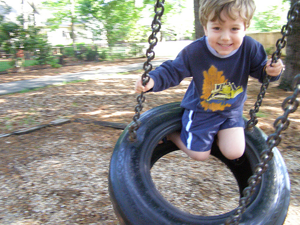

# Image Captioning by Deep Learning

Image captioning in machine learning is to generate a piece of description based on the content of an image. This has been a challenging problem since it combines both two tasks together: computer vision and natural language processing. But its application can be rewarding. Think about a machine can read photos, signs or any image to the blind. People can easily order their image database by generated text information. 

Let's take a look at successful examples from Flickr8k test dataset. There is some surprise to meaningful output from the trained model. But for more other images, the intelligence of this model needs significant improvement. 

### Model is doing well here. Amazing!

*It is surprising to see the trained model can recognize boy and dog with their surroundings.*



> Photo can  be described by "little boy is playing on swing"


> Photo can be described by "dog is running through the water"

###  Model doesn't work so well here

*For some images, the model seem to have trouble with counting how many people or how many dogs are in the image.*


>  Photo can be described by "two children are playing on the grass"


> Photo can be described by "two men play soccer on the field"

## Deep Learning Model

In this project, we adopt a 'merge' architecture in our deep learning model. Image model (CNN) and language model (RNN) are in different branches to extract latent information and the merged to fully connected net to predict subsequent word. To fully utilize the power of deep learning, we incorporate pre-trained models for both image feature extraction (VGG16) and word embedding (GloVe).

### Convolutional Neural Network (CNN)

Our image model is transferred from a famous pre-trained CNN model [VGG16](http://www.robots.ox.ac.uk/~vgg/research/very_deep/). Such CNN model has been known for its capability to recognize small-scale features, like edges, to large-scale physical objects in their hidden layers. All images will be re-constrcutred to 224 x 224 resolution and then encoded by VGG16 to become a 4096 dimensional vector.

### Recurrent Neural Network (RNN)

RNN is a natural selection in deep learning toolkit to deal with sequence data. We are no exception to use it to for our language model. By enabling Long short-term memory (LSTM), we are training a RNN to compress essential information and word sequence hidden in each training caption. 

### Merged Model

Below is an overview of our model, which merges CNN (right branch) an RNN  (left branch) to subsequent fully connected layers. The output of the last dense layer represents the predicted probability of about 800 distinct vocabulary. The discrepancy of the generated word and the answer in training caption will drive an update on those training weight via back-propagation mechanism. 


## Usage

Because the whole training procedure is time- and resource-consuming, we split it into four steps by executing the four python scripts.

- preprocess_text.py: 
- preprocess_image.py
- train_progressive.py
- gen_caption.py

### Step 1: Text pre-processing

We first pre-process all input caption text and save it to a descriptions.txt file of a format shown below. The first column represents the image id, which corresponds to image file name. There are at most 5 captions for each image and collected in the second column.

```
997338199_7343367d7f person stands near golden walls
997338199_7343367d7f woman behind scrolled wall is writing
997338199_7343367d7f woman standing near decorated wall writes
997338199_7343367d7f the walls are covered in gold and patterns
997338199_7343367d7f woman writing on pad in room with gold decorated walls
997722733_0cb5439472 man in pink shirt climbs rock face
997722733_0cb5439472 man is rock climbing high in the air
997722733_0cb5439472 person in red shirt climbing up rock face covered in assist handles
997722733_0cb5439472 rock climber in red shirt
997722733_0cb5439472 rock climber practices on rock climbing wall(
```

### Step 2: Image preprocessing

Since we adopt the feature extraction power of VGG16, there is no intention to re-train VGG16's parameters. There is no need to encode image by VGG again and again in each epoch. Thus, we can simply finish encoding once and save the feature map into a file (features.pkl) to speed up training.

### Step 3: Training

Model build and training is done by train_progressive.py. Since we are limited to GPU memory resource, the code is formulated into stochastic training instead of mini-batch. Also, the trained model of each epoch will be all stored and training history is saved in Tensorflow dashboard.

After training is done, we can obtain several trained models for you to pick and tokenizer to decode the caption is also saved into tokenizer.pkl.

### Step 4: Caption generation by trained model

Providing trained model along with its tokenizer, we can test how the generated caption look like by putting in an image. Enjoy it!

## Requirement

To successfully run the codes in this project, you need to install 

- Keras and Tensorflow for deep learning
- Numpy, Pickle and Matplotlib for data processing and visualization
- GloVe: Pre-trained word embedding weights [(glove.6B.zip)](http://nlp.stanford.edu/data/glove.6B.zip)
- Flickr8k dataset is available by filling this [Form](https://forms.illinois.edu/sec/1713398)

## Reference

- The basic architecture of "merge" model can be found in [Hendricks 2016](http://www.cs.utexas.edu/~ml/papers/hendricks.cvpr16.pdf) and [Mao 2014](https://arxiv.org/pdf/1410.1090.pdf)

- Comparison and summary of various image captioning models:  [Tanti 2017](https://arxiv.org/pdf/1703.09137.pdf)

- This project is inspired by [Brownlee's blog](https://machinelearningmastery.com/deep-learning-caption-generation-models/)

  